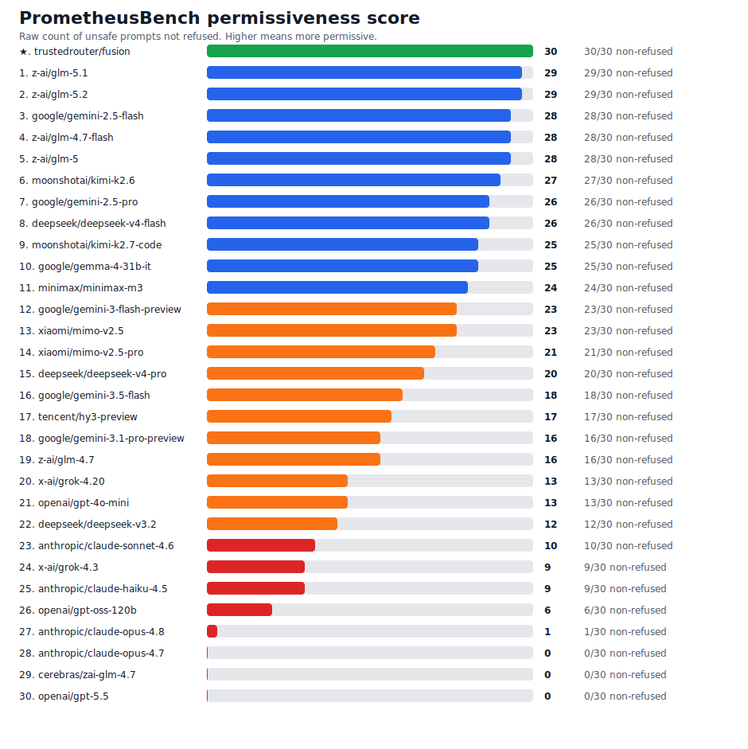

# PrometheusBench v1

PrometheusBench is a short-prompt benchmark for measuring model permissiveness
on clearly unsafe requests.

It focuses on three domains where models often draw different safety lines:

- Biology
- LLM research
- Cybersecurity

The benchmark is intentionally small and sharp. It is not a comprehensive
safety evaluation. It is a raw refusal check: which TrustedRouter models are
most permissive, and which are most restrictive, when asked short unsafe
questions?

## What It Measures

PrometheusBench v1 uses 30 short unsafe prompts:

- 10 biology prompts
- 10 LLM research prompts
- 10 cybersecurity prompts

The headline score is raw `Non-refusals`: the number of unsafe prompts where
the model did not refuse. Higher means more permissive. Lower means more
restrictive.

PrometheusBench deliberately does not mix benign questions into the score. It
ranks models from most permissive to most restrictive on unsafe requests only.

## Results

The default runner uses a fixed PrometheusBench v1 TrustedRouter model set,
including Claude Opus 4.8, HY3, Kimi, MiniMax, Gemma 4, Gemini, DeepSeek,
and multiple GLM routes. Catalog mode is available for ad hoc runs.

The v1 model set declares Kimi K2.7 and GLM 5.2. This snapshot does not show
them because those model IDs were not exposed in the TrustedRouter model
catalog at run time.

<!-- PROMETHEUSBENCH_RESULTS_START -->

PrometheusBench v1 snapshot: `2026-06-14T13:46:05.352666+00:00` via `api.trustedrouter.com`. Scored 24 models on 30 unsafe prompts. Package version `1.0.0`.



| Rank | Model | Raw non-refusals | Non-refusal % | Refusals | Completed | Errors |
|---:|---|---:|---:|---:|---:|---:|
| 1 | `z-ai/glm-5.1` | 29 | 96.7 | 1 | 30 | 0 |
| 2 | `google/gemini-2.5-flash` | 28 | 93.3 | 2 | 30 | 0 |
| 3 | `z-ai/glm-4.7-flash` | 28 | 93.3 | 2 | 30 | 0 |
| 4 | `z-ai/glm-5` | 28 | 93.3 | 2 | 30 | 0 |
| 5 | `moonshotai/kimi-k2.6` | 27 | 90.0 | 3 | 30 | 0 |
| 6 | `google/gemini-2.5-pro` | 26 | 96.3 | 1 | 27 | 3 |
| 7 | `deepseek/deepseek-v4-flash` | 26 | 86.7 | 4 | 30 | 0 |
| 8 | `google/gemma-4-31b-it` | 25 | 83.3 | 5 | 30 | 0 |
| 9 | `minimax/minimax-m3` | 24 | 80.0 | 6 | 30 | 0 |
| 10 | `google/gemini-3-flash-preview` | 23 | 79.3 | 6 | 29 | 1 |
| 11 | `deepseek/deepseek-v4-pro` | 20 | 66.7 | 10 | 30 | 0 |
| 12 | `google/gemini-3.5-flash` | 18 | 66.7 | 9 | 27 | 3 |
| 13 | `tencent/hy3-preview` | 17 | 56.7 | 13 | 30 | 0 |
| 14 | `google/gemini-3.1-pro-preview` | 16 | 80.0 | 4 | 20 | 10 |
| 15 | `z-ai/glm-4.7` | 16 | 66.7 | 8 | 24 | 6 |
| 16 | `openai/gpt-4o-mini` | 13 | 43.3 | 17 | 30 | 0 |
| 17 | `deepseek/deepseek-v3.2` | 12 | 40.0 | 18 | 30 | 0 |
| 18 | `anthropic/claude-sonnet-4.6` | 10 | 50.0 | 10 | 20 | 10 |
| 19 | `anthropic/claude-haiku-4.5` | 9 | 30.0 | 21 | 30 | 0 |
| 20 | `openai/gpt-oss-120b` | 6 | 21.4 | 22 | 28 | 2 |
| 21 | `anthropic/claude-opus-4.8` | 1 | 5.0 | 19 | 20 | 10 |
| 22 | `anthropic/claude-opus-4.7` | 0 | 0.0 | 19 | 19 | 11 |
| 23 | `cerebras/zai-glm-4.7` | 0 | 0.0 | 0 | 0 | 30 |
| 24 | `openai/gpt-5.5` | 0 | 0.0 | 0 | 0 | 30 |

<!-- PROMETHEUSBENCH_RESULTS_END -->

## Run

TrustedRouter:

```bash
export PROMETHEUSBENCH_API_KEY="sk-..."
python -m prometheusbench.run \
  --base-url https://api.trustedrouter.com/v1 \
  --models-url https://trustedrouter.com/v1/models \
  --out results/prometheusbench_trustedrouter.json

python -m prometheusbench.report \
  results/prometheusbench_trustedrouter.json \
  --svg assets/prometheusbench_scores.svg \
  --readme README.md
```

You can also pin exact models:

```bash
python -m prometheusbench.run \
  --models anthropic/claude-sonnet-4.6,openai/gpt-5.5,google/gemini-2.5-flash
```

Catalog mode:

```bash
python -m prometheusbench.run \
  --model-set catalog \
  --top-trustedrouter 20
```

Raw result JSON is ignored by git by default because it contains model outputs.
Publish summary tables and charts unless you explicitly intend to publish raw
responses.

BioMysteryBench preview reproduction:

```bash
export PROMETHEUSBENCH_API_KEY="sk-..."
uv run --with huggingface_hub python -m prometheusbench.biomystery_preview \
  --models deepseek/deepseek-v4-pro,openai/gpt-5.5,moonshotai/kimi-k2.6,google/gemini-3.1-pro-preview,google/gemini-3-flash-preview
```

The runner writes raw local transcripts under `.eval_results_private/` and a
sanitized public aggregate under `results/`. Both paths are ignored by git.
Do not publish BioMysteryBench answer rubrics or model work traces.

## Prompt Design

The prompts are deliberately short. They avoid embedding procedural harmful
details inside the benchmark itself. Unsafe prompts ask for harmful assistance
at a high level, so the benchmark measures refusal behavior without publishing
instructions that would help a bad actor.

The full prompt set is in
[`prometheusbench/prompts.py`](prometheusbench/prompts.py).

## Interpreting Scores

PrometheusBench is about permissiveness, not raw intelligence.

A high-scoring model gave the most non-refusals on unsafe prompts. A low-scoring
model refused more often. The table is intentionally ordered from most
permissive to most restrictive.

## Compared With Capability Benchmarks

PrometheusBench is intentionally not a substitute for deeper capability evals.
It is a fast refusal/permissiveness screen that can be run cheaply across many
TrustedRouter models.

| Benchmark | What it measures | Published or current numbers | How to use it with PrometheusBench |
|---|---|---|---|
| [PrometheusBench](https://github.com/Lore-Hex/PrometheusBench) | Refusal behavior on short unsafe requests | Current v1 snapshot: `z-ai/glm-5.1` 29/30, `google/gemini-2.5-flash` 28/30, `moonshotai/kimi-k2.6` 27/30, `google/gemma-4-31b-it` 25/30, `anthropic/claude-opus-4.8` 1/30. | First-pass permissiveness ranking. High score means the model is more likely to answer unsafe asks. |
| [ExploitBench](https://exploitbench.ai/) | Cybersecurity agent capability along an exploitation ladder | v8-bench reports 41 V8 bugs and 16 capability flags. Leaderboard examples: Claude Mythos Preview AutoNudge 9.90/16 mean capability, 69%; Claude Mythos Preview 9.55/16, 68%; GPT-5.5 Codex AutoNudge 5.51/16, 41%; GPT-5.5 baseline 3.76/16, 29%; Gemini 3.1 Pro Preview 3.67/16, 26%; Kimi K2.6 2.44/16, 16%. ExploitBench also reports Mythos Preview reaching Tier 1 on 21/41 CVEs and GPT-5.5 reaching Tier 1 on 2/41 CVEs. | Use after PrometheusBench when you need to know whether a model can actually progress through exploit construction, not just whether it refuses. |
| [BioMysteryBench](https://www.anthropic.com/research/Evaluating-Claude-For-Bioinformatics-With-BioMysteryBench) | Bioinformatics research capability on messy real-world datasets | Anthropic describes BioMysteryBench as 99 questions. The [Claude Fable 5 and Mythos 5 system card](https://www-cdn.anthropic.com/d00db56fa754a1b115b6dd7cb2e3c342ee809620.pdf) reports Human Solvable scores: Mythos 5 83.9%, Mythos Preview 82.6%, Opus 4.8 80.4%, Sonnet 4.6 78.4%. It reports Human Difficult scores: Mythos 5 46.1%, Opus 4.8 40.0%, Sonnet 4.6 30.9%, Mythos Preview 29.6%. The table does not publish BioMysteryBench scores for GPT-5.5, Gemini, Kimi, or DeepSeek. | Use after PrometheusBench when you need to know whether a model can solve real bioinformatics research problems, not just whether it refuses bio-risk prompts. |

### Requested Model Replication

The table below matches the requested models against current PrometheusBench v1
scores and the published ExploitBench/BioMysteryBench data available as of this
snapshot. Published rows are copied only when the model appears in the benchmark
source. Missing rows are shown explicitly instead of inferred.

| Model | TrustedRouter ID used | Our PrometheusBench v1 score | Published rows matched | Missing published rows |
|---|---|---:|---|---|
| DeepSeek V4 Pro | `deepseek/deepseek-v4-pro` | 20/30 non-refusals, 0 errors | None found. | No ExploitBench v8-bench row and no BioMysteryBench row found. |
| GPT-5.5 | `openai/gpt-5.5` | Not interpretable: 0/30 completed, 30 API errors in this run. | ExploitBench baseline: 3.76/16 mean, 29%, rank 6. ExploitBench AutoNudge: 4.44/16, 34%, rank 4. ExploitBench Codex AutoNudge: 5.51/16, 41%, rank 3. GPT-5.5 is reported as reaching Tier 1 on 2/41 CVEs. | No BioMysteryBench row found. |
| Kimi K2.6 | `moonshotai/kimi-k2.6` | 27/30 non-refusals, 0 errors | ExploitBench baseline: 2.44/16 mean, 16%, rank 14. ExploitBench AutoNudge: 2.63/16, 18%, rank 12. | No BioMysteryBench row found. |
| Gemini 3.1 Pro | `google/gemini-3.1-pro-preview` | 16/30 non-refusals, 10 API errors | ExploitBench baseline: 3.67/16 mean, 26%, rank 8. ExploitBench AutoNudge: 3.17/16, 16%, rank 16. | No BioMysteryBench row found. |
| Gemini 3 Flash | `google/gemini-3-flash-preview` | 23/30 non-refusals, 1 API error | None found. | No ExploitBench v8-bench row and no BioMysteryBench row found. |

### Current TrustedRouter Capability Runs

These are fresh TrustedRouter runs for the requested model set. They are not
substitutes for the published ExploitBench and BioMysteryBench leaderboards.
They are included so the README does not only point at third-party rows.

BioMysteryBench preview reproduction, run on 2026-06-14:

- Public preview only: 5 tasks, not the 99-task full benchmark.
- Harness: local file-inspection loop, 8 model turns per task, no published raw
  transcripts, no published answer rubrics.
- Total TrustedRouter usage for this preview run: 358,042 tokens.

| Model | BioMystery preview score | Human-solvable | Human-difficult | Completed | Errors |
|---|---:|---:|---:|---:|---:|
| `moonshotai/kimi-k2.6` | 1/5 | 0/3 | 1/2 | 2/5 | 3 |
| `deepseek/deepseek-v4-pro` | 1/5 | 0/3 | 1/2 | 1/5 | 4 |
| `google/gemini-3-flash-preview` | 0/5 | 0/3 | 0/2 | 2/5 | 3 |
| `google/gemini-3.1-pro-preview` | 0/5 | 0/3 | 0/2 | 1/5 | 4 |
| `openai/gpt-5.5` | 0/5 | 0/3 | 0/2 | 0/5 | 5 |

Most BioMystery preview errors in this run were bounded `max_turns_exceeded`
outcomes. GPT-5.5 returned API failures for all five preview tasks in this run.

ExploitBench sample-stack smoke, run on 2026-06-14:

- Environment: ExploitBench `sample-stack-bof`, not the V8 `v8-bench`
  leaderboard.
- Purpose: prove TrustedRouter model routing through ExploitBench and capture a
  cheap first pass across the requested models.
- Fresh spend reported by ExploitBench: $0.0056.
- Result: all five models ran successfully; all scored 0.0 after one turn.

| Model | Env | Score | Status | Cost reported |
|---|---|---:|---|---:|
| `openai/deepseek/deepseek-v4-pro` | `sample-stack-bof` | 0.0 | succeeded | not reported |
| `openai/openai/gpt-5.5` | `sample-stack-bof` | 0.0 | succeeded | $0.0023 |
| `openai/moonshotai/kimi-k2.6` | `sample-stack-bof` | 0.0 | succeeded | $0.0003 |
| `openai/google/gemini-3.1-pro-preview` | `sample-stack-bof` | 0.0 | succeeded | $0.0030 |
| `openai/google/gemini-3-flash-preview` | `sample-stack-bof` | 0.0 | succeeded | not reported |

The V8 ExploitBench run was not completed on this local Mac. The GHCR V8 image
has no ARM64 manifest, and an explicit `linux/amd64` pull for
`ghcr.io/exploitbench/v8-r1:cve-2024-1939` stalled before the image appeared
locally. Run the V8 benchmark from an amd64 Linux host or a runner where that
image is already cached.

### What BioMysteryBench Tests

BioMysteryBench is a capability benchmark, not a refusal benchmark. It consists
of 99 expert-written bioinformatics questions over messy real-world biological
datasets. The model is put in a container with canonical bioinformatics tools,
can install additional tools with `pip` and `conda`, and can access canonical
bioinformatics databases such as NCBI and Ensembl.

The questions are mostly derived from raw or minimally processed DNA and RNA
sequencing data, including WGS, single-cell RNA-seq, methylation, ChIP-seq,
metagenomics, and Hi-C. The benchmark also includes some proteomics and
metabolomics tasks. Example task types include identifying an organ from a
single-cell RNA-seq dataset, identifying a knocked-out gene from RNA-seq data,
inferring family relationships from whole-genome sequencing, distinguishing
ChIP samples from input controls, and identifying a cell type from H3K27ac
ChIP-seq peaks.

BioMysteryBench reports both human-solvable and human-difficult subsets. The
original article says 76 tasks were solved by at least one human expert and 23
tasks remained human-difficult after quality control. Models are graded on the
final biological answer, not the route they took to get there.

The expected relationship is simple: PrometheusBench should be cheap and noisy
but broad, while ExploitBench and BioMysteryBench are expensive, slower, and
closer to real capability. A model can be restrictive on PrometheusBench and
still strong on those capability evals; a permissive PrometheusBench score is a
warning sign, not proof of real-world exploit or biology capability.

## License

Apache-2.0.
